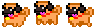

# Free The Pug

#### Game demo: https://lauradecc.github.io/game_project/

### Description

**Free The Pug** is a laberinth videogame in which the player has to move the main character in order to rescue the pug from the enemies, who will take a live from the player if they touch him. 

### Usage

1. The player moves by pressing the arrow keys on the keyboard.
2. Hearts add one live to the player.
3. Skeletons take one life from the player and move it to the initial position.
4. When the player is positioned in front of the chest, a key appears on the map.
5. In order to go to the next level, the player needs to obtain the key and go back to the chest.
6. If the player loses all the lives, you lose.
7. Rescue the pug to win the game.

### Technology

The game has been created with the HTML canvas API, used to draw graphics on a web page, and Javascript to draw the graphics. 

### Additional info

This game is the first project developed by Sergio Puente and Laura de Cos at the Ironhack's Web Development Bootcamp and it has been created in a week.

Happy rescue!
# game_project_1
